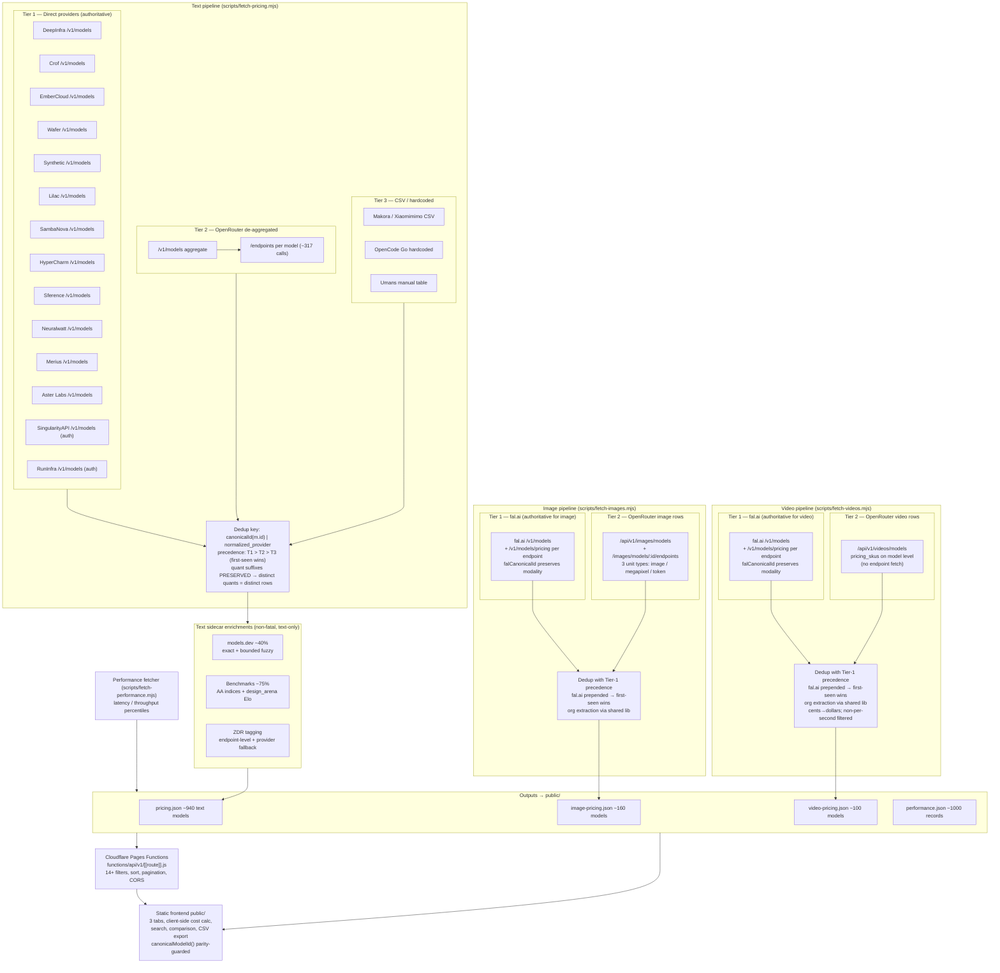

# Architecture

> Full pipeline diagram for TokenWatch. For prose conventions see `AGENTS.md`;
> for canonicalization traps see `docs/canonicalization-edge-cases.md`;
> for settled design choices see `docs/adr/`.

## Pipeline

TokenWatch runs **three parallel fetch pipelines** — text, image, and video —
each with its own source fetch, dedup, and output. Only the text pipeline runs
the non-fatal sidecar enrichments (models.dev, benchmarks, ZDR); image and video
do org resolution and dedup only. A separate performance fetcher writes its own
JSON. Outputs are served by a Cloudflare Pages Functions API and a
zero-dependency static frontend.

## Invariants

Three behavioral contracts the diagram can't show, but an agent must respect:

1. **Dedup key is `canonicalId(m.id) | normalized_provider`; quantization is
   included.** `dedupKey()` in `scripts/lib.mjs:162` uses `canonicalId()`, which
   preserves quant suffixes (`-fp8`, `-nvfp4`, `-int4`, etc.). So different quants
   of the same model+provider produce **distinct dedup keys** and stay distinct
   rows (`test/canonicalization.test.mjs:88-97`). First-seen / highest-tier wins
   among identical keys only. (Note: `orgLookupKey` strips quant for org
   resolution only — it is NOT the dedup key; see
   `docs/canonicalization-edge-cases.md` §2.)

2. **Text enrichments are non-fatal; image/video have none.** A text sidecar
   failure (models.dev down, Artificial Analysis index stale, ZDR endpoint
   unreachable) must never block the 2-hourly deploy — the pipeline writes what it
   has and ships. Image and video pipelines do not run these enrichments at all;
   they do org extraction and dedup only, then write.

3. **`canonicalId` is the single source of truth.** It lives in
   `shared/normalize.mjs` — pure ESM, no `node:` imports, Worker-bundleable —
   imported by both the Node pipeline (via `scripts/lib.mjs`) and the Cloudflare
   Pages Function. The static frontend's `canonicalModelId()` in `public/app.js`
   is an **intentional parity mirror** (the frontend has no bundler), guarded
   against drift by `test/parity.test.mjs`. It is not the sole implementation
   everywhere, but `shared/normalize.mjs` is the sole *source of truth*. See
   `docs/canonicalization-edge-cases.md` before touching either.

## Three pipelines, not one

- **Text** (`fetch-pricing.mjs`) runs 3-tier: direct `/v1/models` providers →
  OpenRouter de-aggregated `/endpoints` → CSV/hardcoded. Direct wins. After
  dedup, the three non-fatal sidecars (models.dev, benchmarks, ZDR) enrich the
  merged rows. Writes `pricing.json`.
- **Image** (`fetch-images.mjs`) runs 2-tier: fal.ai Tier-1 (prepended) +
  OpenRouter `/api/v1/images/models` + per-model `/endpoints`. Three pricing unit
  types (image / megapixel / token). Org extraction + dedup only — no sidecar
  enrichments. Writes `image-pricing.json`.
- **Video** (`fetch-videos.mjs`) runs 2-tier: fal.ai Tier-1 (prepended) +
  OpenRouter `/api/v1/videos/models` with model-level `pricing_skus` (no
  endpoint fetch). Cent→dollar normalization; non-per-second keys filtered.
  Org extraction + dedup only — no sidecar enrichments. Writes `video-pricing.json`.
- **fal.ai is a Tier-1 source for both image and video**, not a post-dedup
  sidecar on the text pipeline. `falCanonicalId` (in `scripts/lib.mjs`) preserves
  modality suffixes `canonicalId` would strip. fal fetch is non-fatal (returns
  `[]` on failure; image/video continue without it).
- **Performance** (`fetch-performance.mjs`) is a separate fetcher writing its own
  `public/performance.json`; not part of any of the three content pipelines.
